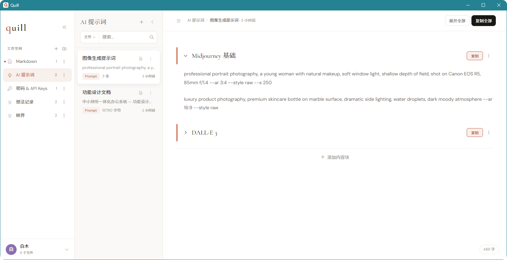
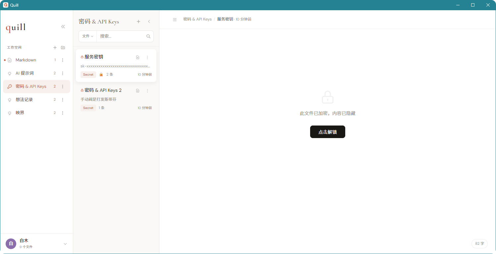
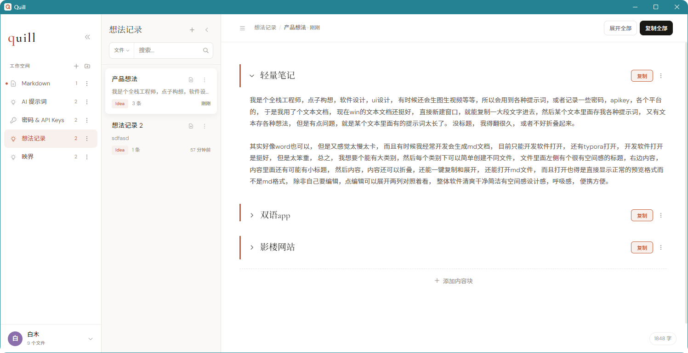
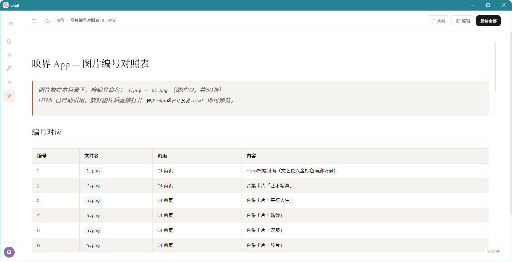

# Quill — 轻量知识管理与代码片段工具

> 基于 Tauri v2 + Vue 3 构建的跨平台极速桌面笔记软件
> 
> 最后更新：2026-04-12 (v1.5)

## 📖 产品简介

一个像记事本一样轻快、像杂志一样好看、像保险箱一样安全的个人知识管理与代码片段工具。
它不仅支持全功能的 Markdown 双向渲染，还专为程序员优化了 JSON、Log、代码等格式的秒开体验，并原生支持与操作系统的无缝拖拽交互。

四层结构：**分类 → 文件 → 内容块 → 内容**

### ✨ 核心特性与功能截图

- **纯净的写作与阅读体验**：支持 4 种全局主题（亮色、暗色、护眼、樱花），支持全局字号无极缩放。
- **强大的 Markdown 解析**：自动生成悬浮大纲（TOC）、代码高亮、数学公式，并支持**源码与预览双向丝滑滚动同步**。
- **程序员友好的 Code 模式**：拖入或打开 `.json`, `.log`, `.js`, `.py` 等文件时，自动进入无干扰的全屏等宽代码编辑模式。
- **原生操作系统的融合**：支持将外部文件、文件夹直接拖拽入软件瞬间完成加载与分类创建。
- **隐私与安全**：支持分类级别的图形/数字密码锁，锁定后内容将被模糊处理并拒绝导出。

#### 1. 提示词与碎片化管理
将零散的 AI 提示词或快捷短语存为一个个“区块”，支持一键折叠、一键复制。


#### 2. 安全的密码与 API Key 保险箱
分类级的密码锁定，未解锁前不仅无法查看，连导出备份也会被严格拦截。


#### 3. 沉浸式产品想法随笔
多款护眼主题搭配优雅的排版，让记录灵感成为一种享受。


#### 4. 强大的 Markdown 双栏编辑
所见即所得，自动提取大纲，双向同步滚动，支持海量文本。


---

## 📥 下载与安装

您可以直接前往本项目的 **[Releases 页面](../../releases)** 下载最新版本的安装包：
- **Windows**: 下载 `Quill_x.x.x_x64-setup.exe` 直接安装。
- **macOS**: 下载 `Quill_x.x.x_x64.dmg` 拖拽安装（如遇安全提示请在系统偏好设置中放行）。

*如果您是开发者，也可以参考下方的「快速开始」自行编译源码。*

---

## 🚀 快速开始（开发者）

```bash
cd quill
npm install

# 1. 浏览器开发与构建
npm run dev          # 浏览器预览（开发模式）
npm run build        # 构建 Web 版本

# 2. Tauri 桌面端开发与打包（需安装 Rust 环境）
npm run tauri dev    # 启动 Tauri 桌面端开发调试

# Windows 用户打包:
# 会在 src-tauri/target/release/bundle/msi 下生成 .msi 安装包
# 和 src-tauri/target/release/bundle/nsis 下的独立 .exe 文件
npm run tauri build

# macOS 用户打包:
# 会在 src-tauri/target/release/bundle/macos 下生成 .app 应用程序
# 和 src-tauri/target/release/bundle/dmg 下的 .dmg 安装镜像
npm run tauri build
```

### 环境要求
- Node.js 18+
- Rust（仅 Tauri 桌面版需要）：`curl --proto '=https' --tlsv1.2 -sSf https://sh.rustup.rs | sh`
- **Windows 打包要求**：需要安装 [C++ Build Tools](https://visualstudio.microsoft.com/visual-cpp-build-tools/) 和 [WebView2](https://developer.microsoft.com/en-us/microsoft-edge/webview2/)。
- **macOS 打包要求**：需要安装 Xcode Command Line Tools (`xcode-select --install`)。

## 📁 项目结构

```
quill/
├── src/
│   ├── main.js                    # 入口，挂载 Vue app + 引入全局样式
│   ├── App.vue                    # ✅ 主布局（CSS Grid 三栏，支持折叠动画）
│   ├── components/
│   │   ├── Sidebar.vue            # ✅ 左侧栏 - 工作空间/收藏区/折叠图标模式
│   │   ├── FilePanel.vue          # ✅ 中间栏 - 文件列表/搜索/拖拽排序
│   │   ├── ContentPanel.vue       # ✅ 右侧栏 - 内容区/内容块/Markdown编辑
│   │   ├── ContextMenu.vue        # ✅ 右键菜单（文件/分类，Teleport方式）
│   │   ├── BlockMenu.vue          # ✅ 内容块右键菜单
│   │   ├── LockOverlay.vue        # ✅ 密码保护弹层（图案+PIN）
│   │   └── Toast.vue              # ✅ Toast 提示
│   ├── stores/
│   │   └── useStore.js            # ✅ 响应式 store + localStorage 持久化
│   ├── styles/
│   │   └── main.css               # ✅ 全局设计系统
│   └── utils/
│       └── (待添加)
├── package.json
├── vite.config.js
└── index.html
```

---

## ✅ 已完成功能（v1.1 — 约 85%）

### 核心架构
- [x] **CSS Grid 三栏布局**（220px / 260px / 1fr）
- [x] **侧栏折叠动画**（220px → 52px，0.3s cubic-bezier）
- [x] **文件栏收起/恢复**（0 宽度动画）
- [x] Vue 3 Composition API + 响应式 Store
- [x] localStorage 数据持久化
- [x] 设计系统（字体：Cormorant Garamond + DM Sans + JetBrains Mono）
- [x] 色彩系统（暖白 #faf9f7 / 铁锈红 #c45d3a / 深色区块 #1a1814）

### 左侧栏（工作空间）
- [x] 4 个默认分类（AI 提示词 / 密码&API Keys / 想法记录 / Markdown）
- [x] 分类图标（sparkle / key / bulb / doc）
- [x] 新建分类（内联编辑，自动聚焦 + 自动选中文字）
- [x] 分类拖拽排序
- [x] 分类置顶（小圆点标记）
- [x] 分类折叠为纯图标模式（52px 宽）
- [x] **收藏区** — 位于工作空间下方，显示所有收藏的文件，点击快速跳转

### 中间栏（文件列表）
- [x] 文件显示（名称、内容预览、标签、锁定状态🔒、条目数）
- [x] 新建文件（自动生成默认名称，自动聚焦内容区）
- [x] 文件拖拽排序
- [x] 文件置顶
- [x] 三点更多按钮（hover 显示，点击触发右键菜单）
- [x] 搜索功能（三种范围：当前文件 / 当前分类 / 全局）
- [x] 搜索清除按钮（Escape 键或点击 X）
- [x] 空状态提示 + 创建按钮

---

## 📬 交流与反馈

我是 **Sky白木**（全栈开发 / 独立创造者）。  
如果在软件使用过程中遇到任何 Bug、或者您有任何绝妙的新点子和需求，欢迎随时联系我！

- 📧 **邮箱反馈**: [skybaimu@gmail.com](mailto:skybaimu@gmail.com)
- 🐛 **提交 Issue**: [点击这里提交 GitHub Issue](../../issues)

### 右侧栏（内容区）
- [x] 面包屑导航（分类 / 文件名）
- [x] 文件标题（Cormorant Garamond 26px）
- [x] 内容块结构（标题 + 折叠/展开 + 操作按钮）
- [x] 内容块折叠/展开（带 transition 动画）
- [x] 新增内容块（+ 按钮，自动聚焦 textarea）
- [x] 展开全部 / 折叠全部
- [x] 复制全部
- [x] 字数统计（右下角浮动）
- [x] Textarea auto-grow（自适应高度）

### 右键菜单
- [x] 文件右键（重命名 / 置顶 / 收藏 / 复制文件 / 密码保护 / 删除）
- [x] 分类右键（重命名 / 置顶 / 删除）
- [x] 内容块右键（重命名 / 收藏 / 删除）
- [x] Teleport 到 body，z-index 正确分层
- [x] 点击外部自动关闭

### 内容块操作
- [x] 标题行左侧：折叠/展开箭头（点击标题行也可切换）
- [x] 标题行右侧：●●● 更多菜单 + 📋 复制按钮
- [x] 操作按钮 hover 时才显示
- [x] 点击内容区进入编辑模式

### 密码保护
- [x] 图案密码（3×3 九宫格，至少 4 点）
- [x] 数字 PIN（4 位，数字键盘）
- [x] 首次设置密码（图案/PIN 二选一）
- [x] 解锁验证（成功/失败动画）
- [x] 验证错误抖动动画
- [x] API Key 暗色区块 + 模糊显示 + 点击解锁

### Markdown
- [x] 自动渲染模式（打开即显示渲染效果）
- [x] 编辑模式（左右分栏：预览 + 源码）
- [x] 实时同步（输入即更新预览）
- [x] 基础语法（标题/粗体/斜体/代码块/引用/列表）

### 动效 & 交互
- [x] 侧栏折叠 0.3s cubic-bezier
- [x] 文件栏收起 0.3s
- [x] 内容块展开/折叠 transition
- [x] 右键菜单 scale 动画
- [x] Toast 浮层动画
- [x] 密码错误抖动
- [x] 新建条目 slideIn 动画

### 其他
- [x] Toast 提示（2 秒自动消失）
- [x] Toast 构建验证通过

---

## ❌ 待开发（剩余 ~3%）

### 高优先级
- [ ] **Tauri 桌面配置** — 需在有 Rust 的机器执行 `npm run tauri dev`

### 中优先级
- [ ] **文件/内容块拖拽半透明预览**

### 低优先级 / 增强
- [ ] 深色模式
- [ ] 国际化（中/英）
- [ ] 自动更新
- [ ] 系统托盘

---

## ✅ v1.2 新增功能（已完成）

- [x] **搜索结果高亮** — 匹配文字黄色高亮显示
- [x] **搜索时内容块过滤** — 文件内搜索隐藏不匹配的内容块
- [x] **Markdown 分栏宽度拖拽调整** — 编辑模式下拖拽分隔条
- [x] **导入/导出** — 全量 JSON 导出/导入，单文件导出为 .txt/.md
- [x] **标签自动分配** — 根据分类自动设置 Prompt/Secret/Idea/Markdown 标签
- [x] **快捷键** — Escape 关闭弹窗、Ctrl+N 新建文件、Ctrl+B 切换侧栏、Ctrl+/ 聚焦搜索、Ctrl+Shift+N 新建内容块
- [x] **文件更新时间显示** — 面包屑和文件列表中显示相对时间

## ✅ v1.4 修复与优化（已完成）

### 密码系统重构
- [x] **全局密码** — 设置一次，所有文件共用，取消保护只需输入密码
- [x] **密码管理** — 设置中心新增更换密码、删除密码功能
- [x] **图案密码优化** — 增大绘制区域（240px），划线穿过圆心
- [x] **密码保护生效** — 锁定文件必须输入密码才能查看

### UI/UX 修复
- [x] **汉堡菜单** — 侧栏导入导出改为下拉菜单位置在图标下方
- [x] **文件菜单常驻** — 文件栏右侧三点菜单不再 hover 才显示
- [x] **导出优化** — Tauri 环境下弹出保存对话框
- [x] **标题样式** — 文件名和内容块标题使用主题色 + 左侧粗色线
- [x] **复制按钮** — 使用主题色边框，更醒目
- [x] **添加内容块按钮** — 简化为仅上边虚线
- [x] **粘性标题** — 文件名滚动时钉在顶部，内容块标题钉在文件名下方
- [x] **内容区底部留白** — 增加底部空间
- [x] **内容宽度** — 最大宽度从 800px 放宽到 1000px
- [x] **新建文件** — 自动生成带序号名称，光标直接进入内容块
- [x] **字体大小** — 修复设置中心字体大小切换实际生效
- [x] **关于信息** — 添加作者 Sky白木 (skybaimu@gmail.com)

---

## ✅ v1.3 新增功能（已完成）

### 密码系统全面重构
- [x] **PBKDF2 + SHA-256 加密** — 每密码独立随机 salt，10 万次迭代，明文不再存储
- [x] **三步设置向导** — 数字密码(必须) → 图案密码(可跳过) → 安全问题(可选)
- [x] **安全问题重置** — 预设 8 个问题，忘记密码时验证后重置
- [x] **智能解锁** — 根据已设密码类型自动显示可用方式
- [x] **旧密码自动迁移** — 明文密码首次解锁时静默升级为加密格式

### 用户中心
- [x] **左下角头像** — 根据昵称自动分配颜色，显示首字母
- [x] **数据统计** — 分类数/文件数/已加密文件数
- [x] **字体大小切换** — 小/中/大
- [x] **快捷键参考面板**

### 搜索 & 文件操作
- [x] **搜索栏重设计** — 范围选择合并到搜索框左侧下拉，搜索图标在右侧
- [x] **文件区导出按钮** — hover 显示导出图标，支持 .md / .txt / .json

### 内容区优化
- [x] **Sticky 标题** — block 标题滚动时钉在顶部，新标题自动顶走旧标题
- [x] **标题样式** — font-weight:700 + 深色 #2d2520
- [x] **复制按钮** — 从小图标改为文字「复制」按钮

### 其他
- [x] **Markdown 分类修复** — 新建文件自动判断 type（md 分类→markdown）
- [x] **文件关联配置** — tauri.conf.json 注册 .md/.txt 文件类型

## ✅ v1.5 新增功能（当前）

### Markdown 深度解析与排版优化
- [x] **代码高亮** — 接入 Highlight.js 与 Atom One Dark 主题，支持数十种语言
- [x] **数学公式** — 接入 KaTeX 插件，支持单美元符行内公式与双美元符多行公式
- [x] **GitHub 提示块 (Alerts)** — 支持 `> [!NOTE]` / `TIP` / `IMPORTANT` / `WARNING` / `CAUTION` 渲染
- [x] **任务列表美化** — 重写 CSS `:has` 伪类样式，消除无序列表圆点，贴近原生 Todo-list
- [x] **排版细节** — 表格斑马线、引用色块等多种文字样式更新

### 安全与免密系统
- [x] **30 分钟免密会话** — 密码区验证通过后，30分钟内查看其他加密文件免输入，提升连贯性体验
- [x] **随时锁定** — 新增顶部栏锁定按钮，离开时可一键结束免密会话
- [x] **状态自适应** — UI图标会随免密状态（锁定/解锁）实时切换

### 其他修复
- [x] **Tauri 原生导出支持** — 配置 `fs:allow-write-text-file`，修复桌面版环境无权限报错
- [x] **密码类文件统计** — 修复设置中心加密文件数量统计不准的问题
- [x] **无缝内容滚动** — 使用 `box-shadow` 遮罩修复文件栏文本溢出到 Sticky 标题上方的视觉问题

---

## 🎨 设计规范速查

| 项目 | 规格 |
|------|------|
| 侧栏宽度 | 220px（折叠 52px） |
| 文件列表宽度 | 260px（收起 0px） |
| 内容区 | 1fr（弹性） |
| Logo | Cormorant Garamond 22px / weight-300 |
| 文件标题 | Cormorant Garamond 26px / weight-300 |
| 内容块标题 | Cormorant Garamond 17px / weight-700 |
| 正文 | DM Sans 14px / weight-400 |
| 代码 | JetBrains Mono 12-13px / weight-400 |
| 主背景 | #faf9f7 |
| 卡片背景 | #ffffff |
| 强调色 | #c45d3a |
| 强调背景 | #f8f0ec |
| 深色区块 | #1a1814 |
| 危险色 | #c44a3a |
| 成功色 | #4a8c6f |
| 圆角 | 8px（常规）/ 12px（弹窗） |
| 阴影 | sm: 0 1px 3px / md: 0 4px 12px / lg: 0 8px 32px / xl: 0 16px 48px |

---

## 📦 版本历史

| 版本 | 日期 | 内容 |
|------|------|------|
| v1.0 | 2026-04-11 01:47 | 初始版本，基础框架 + 所有组件 |
| v1.1 | 2026-04-11 01:52 | Grid布局、收藏区、折叠动画、搜索增强、Markdown分栏、Teleport菜单、auto-grow |
| v1.2 | 2026-04-11 09:18 | 搜索高亮+内容块过滤、快捷键、导入导出、时间显示、Markdown拖拽、标签自动分配 |
| v1.3 | 2026-04-11 10:55 | 密码加密(PBKDF2)、三步设置向导、安全问题、用户中心、搜索栏重设计、文件导出、sticky标题、文件关联 |
| v1.4 | 2026-04-11 17:41 | 全局密码系统、汉堡菜单、标题样式优化、粘性标题修复、字体大小修复、图案密码加大、导出对话框 |
| **v1.5** | **2026-04-11 22:30** | **Markdown 深度解析 (高亮、数学公式、GitHub 提示块、任务列表优化)、30 分钟免密会话、Tauri 原生导出支持、UI/UX 细节完善** |
